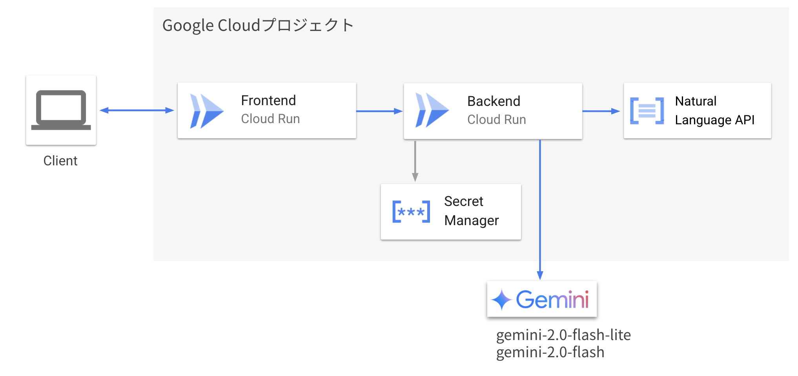

<p align="center">
  <br>
  
</p>

<p align="center">
選ぶだけで日記が書ける。<br>
日記にもっと「らく」に。
</p>

<p align="center">
  <a href="https://your-youtube-link.com"></a>
  <a href="https://your-zenn-link.com"></a>
  <a href="https://github.com/yourusername/rakuraku-diary"></a>
</p>

<br>

## 🌐 アクセスリンク

- 📺 [YouTube デモ動画](https://your-youtube-link.com)
- ✍️ [Zenn 解説記事](https://your-zenn-link.com)
- 🌐 [デプロイ済み Web アプリ](https://your-app-link.com)

<br>

## 🧰 システムアーキテクチャ図

  

<br>

## 🛠 セットアップ

### 必要な環境

- Node.js >= 20
- Docker / Git

#### フロントエンド起動

```bash
cd frontend
npm install
npm run dev
```

#### バックエンド起動

```bash
cd backend
docker compose up -d
```

## 🐾 Special Thanks

このアプリは、「第 2 回 AI Agent Hackathon with Google Cloud ハッカソン」 にて開発されました。<br>
素敵なイベントをありがとうございます 💖
