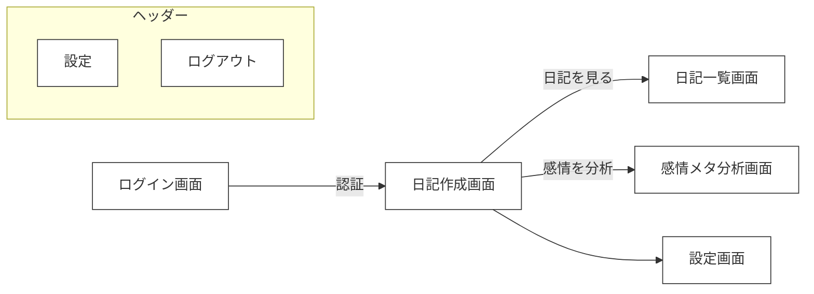
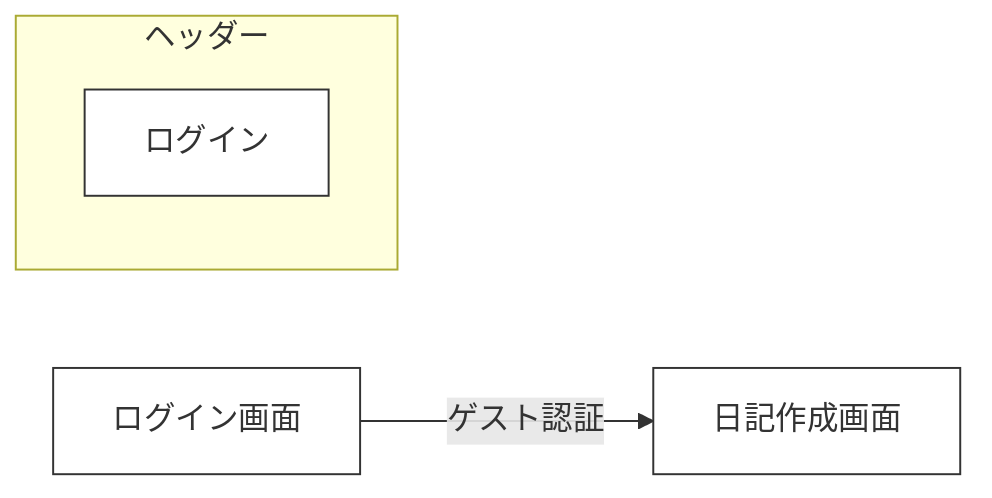

通常ログイン時

```mermaid
%% ログイン
graph LR
classDef default fill: #fff,stroke: #333,stroke-width: 1px;

ログイン画面--認証-->日記作成画面
日記作成画面--日記を見る-->日記一覧画面
日記作成画面--感情を分析-->感情メタ分析画面
日記作成画面-->設定画面


subgraph ヘッダー
設定
ログアウト
end
```

ゲストログイン時

```mermaid
%% ゲストログイン
graph LR

  classDef default fill: #fff,stroke: #333,stroke-width: 1px;

  ログイン画面--ゲスト認証-->日記作成画面

  subgraph ヘッダー
    ログイン
  end
```
